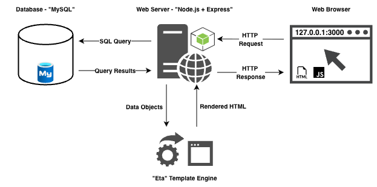
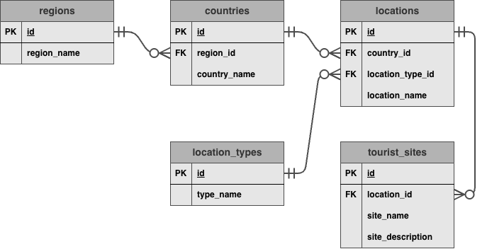

# Basic Node.js Template with Express, Eta, and MySQL

### Basic Project Diagram

<p align="center">
  
</p>

### The Template Engine (Eta)

-   Eta is an embedded JavaScript template engine.
-   [Eta](https://eta.js.org/) is an alternative to [EJS](https://ejs.co/).
-   This project uses Eta for server-side rendering (SSR) with the Express framework.

---

### Basic ERD Diagram (Entity Relationship Diagram)

<p align="center">
    
</p>

### The Database

-   [MySQL Community](https://www.mysql.com/products/community/) is an open-source relational database.
-   This project uses `mysql2/promise` for easy async database access with Node.js/Express.

---

## Project Setup

```bash
npm init -y
npm install express eta dotenv mysql2
```

```bash
# Development: reload the server on file changes:
npm install --save-dev nodemon
```

### Run the project in the terminal

```bash
# Production:
# Add new command in the script section in package.json file:
# "start": "node backend/server.js"
npm run start
```

```bash
# Development:
# Add new command in the script section in package.json file:
# "dev": "nodemon backend/server.js --watch backend --watch frontend/public --watch frontend/views --ext js,css,eta",
npm run dev
```
